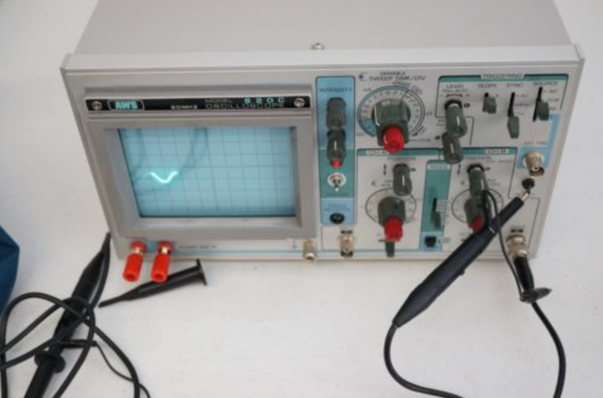

Background
----------

By trade I am a software developer (technically, my title is
"Software Architect") working for a company you've never heard of.

By training, however, I am a physicist. I have a Master's degree in physics
plus a couple more years towards a never-completed PHd and as a phycisist I
picked up just a little bit of knowledge of electronics. In fact, my interest
in electronics precedes my interest in physics. In fact, I was enough of a
nerd to request an Oscilloscope for my high-school graduation gift.  My parents,
having long given up on trying to interest me in sports, reluctantly purchased
a $500.00 AWS MODEL 620C 20Mhz Dual Trace Oscilloscope. A 20Mhz oscilloscope
may not seem like much today, but this was quite the piece of equipment in
1985, believe me.

Anyways, I won't distract you with anymore of the fascinating details of
my amazing life. After all, you came here to read all about my adventures
with making PCB boards on a CNC router! Suffice to say, life happens, and
I find myself getting back into electronics after more years than I would like
to count, but being extremely unsatisfied with the results I am getting
from etching PCBs. I want something more faster, more reliable, and
requiring less contact with poisonous chemicals!

Before I move on, though, you should know that I have almost no knowledge
of CNC. I once had some clients that did a lot of CNC work and I sometimes
made serial cables for them to connect their equipment to their computers
and would help them move files around a bit. From that I learned that CNC
machines speak something called "G-code" and that's about all I know.

I'm planning on documenting everything I learn here. If you know nothing
and want to learn with me, you might want to keep on reading.

If you know lots and want to help me learn (or just make me feel stupid),
go ahead and open up an issue, send me an email_, or even clone my repo
and make a pull request!

.. _email: mailto:scott@bintouch.org

