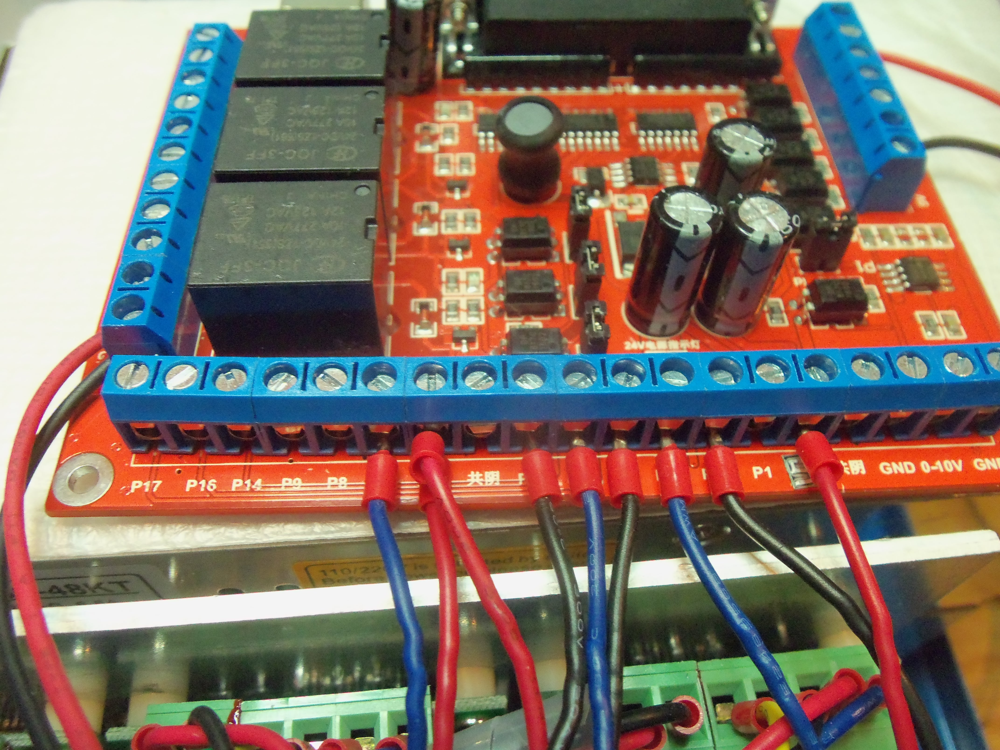

CNC Router
----------

Budget
~~~~~~

Although I'm pretty comfortable financially, I don't want my electronics
hobby to impact my family's lifestyle so I decided to try to limit my CNC
budget to $500.00 I received from various family for Christmas this year.

I can go over this if necessary, but it makes a pretty good starting point.

Research
~~~~~~~~

Since I know nothing about CNC, I was pretty much in the dark about what
to look for. I had read articles about things like ShapeOko which was a kit
that sold for $175.00 a few years ago if you were lucky enough to be able
to get your hands on one so I started there, but soon found that the
original ShapeOko is a thing of a short and by-gone era. In fact none of
the links_ from any of the original articles_ I had read even worked.

.. _links: http://www.shapeoko.com/purchase

.. _articles: http://makezine.com/2012/03/16/shapeoko-the-300-cnc-kit/

ShapeOko is apparently now called carbide3d_ and their stuff starts at around
$1099.00 now. *Way* out of my budget!

.. _carbide3d: http://carbide3d.com/shapeoko/

I began surfing Amazon_ and Ebay_ looking at various models of CNC routers and
realized that lots of little Chinese outfits were building a number of small
units for around my price point. One could even get 4-axis machines for not
much more!

.. _Amazon: http://amazon.com

.. _Ebay: http://ebay.com

Unfortunately, I started this documentation project about a month after getting
started and I did not record any of my research, so I'll just
`cut to Hecuba`__:

__ https://en.wikipedia.org/wiki/Cut_to_the_chase

- One should choose a controller with a parallel port interface. it is widely
  accepted in the hobby CNC community that the USB interface does not provide
  accurate enough timing.

- Mach3_ and LinuxCNC_ are the two most popular pieces of software used to
  drive a cnc machine. Mach 3 is a Windows application while LinuxCNC is
  an entire Linux distribution. The primary role of either of these pieces of
  software is to convert "G-code" into the actual control pulses that drive
  the stepper motors on the CNC machine.

.. _Mach3: http://www.machsupport.com/shop/mach3/

.. _LinuxCNC: http://linuxcnc.org
  
- Mach3 is a Windows program that is by far the most popular tool but is
  not open source and costs $175.00.  All of these cheap, Chinese routers
  claim to come with a licensed copy of Mach 3, but I'm not sure I believe it.
  How could they provide the machine so inexpensively and also provide a
  $175.00 worth of software? My guess is that they provide the demonstration
  version.
  
- Mach3 can make use of an external motion controller, which, if
  I understand correctly is an external micro-controller that converts G-code
  into control pulses. In this configuration, Mach3 would act as a handy
  interface tool, but wouldn't be doing any of the heavy lifting. Presumably,
  usb would be a perfectly adequate interface in this case since the timing
  would be done by the micro-controller. There seem to be a number of project
  that use Arduino_ and `Raspberry Pi`_ as micro-controllers.

.. _Arduino: https://www.arduino.cc/

.. _`Raspberry Pi`: https://www.raspberrypi.org/

- LinuxCNC is an entire Linux distribution, entirely open source (GPLv2_),
  and not nearly as popular in the CNC community as Mach3. It will probably
  be my choice since I don't own a computer with Windows on it. LinuxCNC is
  adamant that LinuxCNC is the motion controller. They don't support usb at
  all!

.. _GPLv2: http://www.gnu.org/licenses/old-licenses/gpl-2.0.html

- Most of the CNC machines available for sale have a USB interface. I didn't
  know at the time whether this meant that they had a motion controller on
  board or what. (note: I have since learned that they have a USB/parallel
  converter with some CNC-specific features). I will have to be careful to
  order one with a Parallel port.

Gathering the Equipment
~~~~~~~~~~~~~~~~~~~~~~~

Eventually I settled on this_ machine which was a Chinese build, but already
in America which meant I could get it in a few days instead of a few weeks. It
is a brandless, 30cm x 20cm x 50mm (11" x 8" x 2") 3-axis machine

.. _this: http://www.ebay.com/itm/132045117295?_trksid=p2057872.m2749.l2649&ssPageName=STRK%3AMEBIDX%3AIT

The astute observer will note that the linked description is of a USB machine.
And indeed, that is what they sent me! I which I had a screenshot of the
original description, because I swear to God it was for a parallel port
machine. It even had a series of photographs showing how to tell you if your
computer was equipped with a parallel port and several separate warning to
be sure you understood that this thing would not work with USB!

I sent the seller the message shown below:

.. image:: images/msg-to-seller1.png

Since the seller is in China, I had at least a day to wait for a response, so
in the meantime I looked into what I could do about this problem myself.

The controller unit has what appears to be an anti-tampering sticker on it,

.. image:: images/sticker.jpg

so I don't want to open it up and risk losing my warranty.
:download:`By peering through the vent openings in the side
<images/vent-peep.mov>`, I can make out that the USB card is red with
green terminal blocks along the left and back edges and a 10-pin header along
the right edge.

A search with Google images (and a *lot* of scrolling) brought
me to the card_ shown below.

.. _card: https://www.aliexpress.com/item/Free-shipping-CNC-MACH3-USB-4-Axis-100KHz-USB-CNC-Smooth-Stepper-Motion-Controller-card-breakout/32704620352.html?spm=2114.01010208.3.22.3YCsJn&ws_ab_test=searchweb0_0,searchweb201602_3_10065_10068_10000009_10084_10083_10080_10082_10081_10060_10062_10056_10055_503_10054_10059_10099_10078_501_10079_426_10103_10073_10102_10096_10052_10053_10050_10107_10051_10106,searchweb201603_2,afswitch_5&btsid=10818071-d18a-498f-a232-8224931290e0

.. image:: images/usb-controller-card.png

Somewhere, and don't ask, because I don't remmber where, I came across a
description of parallel port pins to CNC usage.  I have combined that with
standard parallel port pinout_ information to create the following table:

.. _pintout: http://www.jspayne.com/io/schematics.html

+------+--------+------------------------------+---------------+-----------+
| Port | Cntr   | Description                  | Printer Usage | Direction |
+------+----------+------------------------------+---------------+-----------+
| P1   | C1     | ?                            | STROBE        | Out *     |
+------+--------+------------------------------+---------------+-----------+
| P2   | C2     | X pulse                      | DATA 0        | Out       |
+------+--------+------------------------------+---------------+-----------+
| P3   | C3     | X direction                  | DATA 1        | Out       |
+------+--------+------------------------------+---------------+-----------+
| P4   | C4     | Y pulse                      | DATA 2        | Out       |
+------+--------+------------------------------+---------------+-----------+
| P5   | C5     | Y direction                  | DATA 3        | Out       |
+------+--------+------------------------------+---------------+-----------+
| P6   | C6     | Z pulse                      | DATA 4        | Out       |
+------+--------+------------------------------+---------------+-----------+
| P7   | C7     | Z direction                  | DATA 5        | Out       |
+------+--------+------------------------------+---------------+-----------+
| P8   | C8     | A Pulse                      | DATA 6        | Out       |
+------+--------+------------------------------+---------------+-----------+
| P9   | C9     | A direction                  | DATA 7        | Out       |
+------+--------+------------------------------+---------------+-----------+
| P10  | C10    | IN1 connected emergency stop | ACK           | In  *     |
+------+--------+------------------------------+---------------+-----------+
| P11  | C11    | IN2 standby                  | BUSY          | In        |
+------+--------+------------------------------+---------------+-----------+
| P12  | C12    | IN3 spare                    | PAPER END     | In        |
+------+--------+------------------------------+---------------+-----------+
| P13  | C13    | IN4 3-axis limit             | SELECT        | In        |
+------+--------+------------------------------+---------------+-----------+
| P14  | C14    | relay port                   | AUTOFEED      | Out *     |
+------+--------+------------------------------+---------------+-----------+
| P15  | C32    | IN5 spare                    | ERROR         | In  *     |
+------+--------+------------------------------+---------------+-----------+
| P16  | C31    | relay port                   | INIT PRNTR    | Out *     |
+------+--------+------------------------------+---------------+-----------+
| P17  | C36    | relay port                   | SELECT IN     | Out       |
+------+--------+------------------------------+---------------+-----------+
| P18  | C33    | signal ground                                            |
+------+--------+------------------------------+---------------+-----------+
| P19  | C19,20 | signal ground                                            |
+------+--------+------------------------------+---------------+-----------+
| P20  | C21,22 | signal ground                                            |
+------+--------+------------------------------+---------------+-----------+
| P21  | C23,24 | signal ground                                            |
+------+--------+------------------------------+---------------+-----------+
| P22  | C25,26 | signal ground                                            |
+------+--------+------------------------------+---------------+-----------+
| P23  | C27    | signal ground                                            |
+------+--------+------------------------------+---------------+-----------+
| P24  | C28,29 | signal ground                                            |
+------+--------+------------------------------+---------------+-----------+
| P25  | C16,30 | signal ground                                            |
+------+--------+------------------------------+---------------+-----------+
| * indicates an active low signal                                       |
+------+--------+------------------------------+---------------+-----------+

.. image:: images/db25-pinout.png

I reasoned that the usb controller board was really just a parallel port
adapter with some opto-isolator chips. All I needed was a parallel board
with similar features so I ordered this_ one from ebay. Unfortunately, it
would take at least 3 weeks to arrive since it was coming from China!

.. _this: http://www.ebay.com/itm/291620685428?_trksid=p2060353.m2749.l2649&ssPageName=STRK%3AMEBIDX%3AIT

The next day, my CNC seller got back to me!

.. image: images/msg-from-seller1.png

Not very helpful. The main problem I had was having the wrong controller. I
tried again:

.. image: images/msg-to-seller2.png

And a day later:

.. image: images/msg-from-seller2.png

Ok. Now we're getting somewhere! Not only had I done the right thing by
ordering the parallel port board, but they were giving me permission to open
the controller box.

Inside the Controller Box
~~~~~~~~~~~~~~~~~~~~~~~~~

It would appear that I did, in fact, find the correct USB controller board with
google images.

.. image:: images/controller-board.jpg

More on the controller board later.

Power Supplies
++++++++++++++

There are two power supplies.

Upper Supply
............

The upper one is a variable power supply:

.. image:: images/upper-ps.jpg

+-------+-------+-----+-----+----+--------+--------+
|  V+   |  V+   | G   | G   | FG | L      | N      |
+-------+-------+-----+-----+----+--------+--------+
| 0-46V | 0-46V | Gnd | Gnd | ?  | 110V H | 110V N |
+-------+-------+-----+-----+----+--------+--------+

The voltage is controlled via an externally mounted 4.2K pot.

It powers the spindle and it's output terminals go directly to "Control Output"
pins 35 (+) and 36 (gnd).

Lower Supply
............

The lower power supply is a +24V supply:

+--------+--------+----+-----+-----+------+------+
| L      | N      | FG | G   | G   | V+   | V+   |
+--------+--------+----+-----+-----+------+------+
| 110V H | 110V N | ?  | Gnd | Gnd | +24V | +24V |
+--------+--------+----+-----+-----+------+------+

This supply may also be variable as there is a small pot next to the power
rail.

.. image:: images/small-pot.jpg

The output terminals from this power supply are wired to three identical boards
labeled TX13130. More on these later, but basically these drive the motors and
are controlled by signals from the controller board. There is one of these
boards for each of the three axis of the CNC machine.

Driver Boards
+++++++++++++

The driver boards are labeled TX13130 and
each contains two 4N25 optocouplers and one EL817 photocoupler. On the back
side of each of these boards are an approx 1/2 square IC all of which are
thermally cemented to a single thick piece of alumninum which is server as a
heat sink. In addition there is another small chip back there. I was expecting
a simple H-bridge chip (which I learned about from an instructables_ article)
but this chip is more complicated.

.. _instructables: http://www.instructables.com/id/Controlling-a-Stepper-Motor-with-an-Arduino/

There are five inputs labeled EN, DIR, CLK, NG and +U. EN and NG are not
connected to anything. +U is connected to terminals labelled 5V on the
controller board while DIR and CLK are connected to xD and xP (where x is one
of X, Y, or Z) also on the controller board.

I must say, the Internet is failing me when it comes to learning about this
board. I did find a Reddit post_ which claims the board uses an A3977_
microstepping driver.

.. _post: https://www.reddit.com/r/hobbycnc/comments/4fah3l/so_i_have_a_cheap_3040_and_a_pile_of_parts_to/

.. _A3977: http://www.allegromicro.com/en/Products/Motor-Driver-And-Interface-ICs/Bipolar-Stepper-Motor-Drivers/A3977.aspx

For now I'm just going to have to hope that the people that made my controller
box understood how to use this board and match the wiring they did as best
I can using the chart above to translate xD and xP (x = X, Y, or Z) into ||
port pin numbers.

USB Controller Board
++++++++++++++++++++

Finally we circle back to the controller board. We've already learned a lot
about it.

.. image:: images/usb-controller.jpg

We understand the xD and xP (Direction and Pulse) connections.

There are a series of INx (x=1-4) and OUTx (x=1-4) terminals none of which are
connected to anything except IN1 is connected to the emergency stop button. The
other side of the button is connected to a terminal marked AVI-.

Another pair of terminals called COM+ and COM- are connected to the +24V and
GND terminals, respectively, of the 24V power supply. I don't know why those
are needed. The do not power the board as even with the box turned on the
+V terminals float. The board itself must be powered from the usb port.

When I plug in the USB port, a red led flashes on the board and the +V
terminals are now showing a steady 4.84V. Here is a chart of everything
connected on the board:

+------+-----------------------------------------------+
| Term | Connection                                    |
+------+-----------------------------------------------+
| COM+ | +24V                                          |
+------+-----------------------------------------------+
| COM- | GND of 24V PS (not connected to board ground) |
+------+-----------------------------------------------+
| IN1  | Emergency Stop Switch
+------+-----------------------------------------------+
| AVI- | Emergency Stop Switch                         |
+------+-----------------------------------------------+
| 5V   | +U on driver boards                           |
+------+-----------------------------------------------+
| xP   | CLK on driver boards                          |
+------+-----------------------------------------------+
| xD   | DIR on driver boards                          |
+------+-----------------------------------------------+

While I plan to replace this board, I have discovered via a post_ that one
can use this board with Mach3 using a dll called
:download:`RnRMotion.dll <RnRMotion.dll>`

.. _post: https://www.tapatalk.com/topic/11158-cnczone-com/326812-help-id-this-controller-in-my-chinese-3040

I plan to use LinuxCNC_ which is adamantly opposed to USB controller boards
on the grounds that the USB does not offer good enough timing control, which is
why I plan on replacing the board.

.. _LinuxCNC: http://linuxcnc.org/

Parallel Controller Board
~~~~~~~~~~~~~~~~~~~~~~~~~

I purchased a parallel breakout board_ from Ebay.

.. _board: http://www.ebay.com/itm/291620685428?_trksid=p2060353.m2749.l2649&ssPageName=STRK%3AMEBIDX%3AIT

The board has three sets of terminals which are fairly self-explanatory with
some exceptions. I also found an image that helps with things.

The board also contains a "USB PWM Spindle" circuit. I'm assuming tha tPWM

Right Terminal Block
++++++++++++++++++++

The left terminal block has terminals labelled IN1-IN5, GND, and 5V.

Clearly, IN1 should be connected to the emergency stop switch but it is not obvious
what is the equivalent, on the new board, of AVI- on the USB board (the USB
board also has a terminal labelled AVI+). Using the printer pinout table
above, it is easy to see how these are connected. what isn't clear is whether
the board converts the active low signal ports to normal high signal or not.
I will have to do some testing to determine that.

Here's what I found. All of the inputs are pulled high with a pull-up resistor.
What you do is connect your normally-closed switch(es) from GND to an input.
This will hold the input to Ground until a switch opens in which case it gets
pulled high. Normally this will be considered an error condition and hald the
CNC machine. If you need to use a normally-open switch for something, you can
tell the software to work the other way around.

Note that the 5V terminal is *not* powered by the usb connector. The image
describes it as 5V power output, but I don't know from where it gets it's
power. From the 24V input maybe? Yes. that turns out to be exactly right.

Here is the right block all wired up:

The red wire runs to the emergency stop button and the green wire runs to
the `limit switches`_ I installed.

Left Terminal Block
+++++++++++++++++++

The left terminal block has terminals labelled in chinese characters followed
by 1, 2 or 3.

.. image:: images/left-terminal-block.jpg

There are three blocks with 1, three with 2, and three with 3. Using a
contininuity tester and by examining the traces it was easy to see that the
terminals work as follows:

+------+--------+-------+
| Left | Center | Right |
+------+--------+-------+
| NO   | C      | NC    |
+------+--------+-------+
| EC   | C      | EO    |
+------+--------+-------+
| NO = Normally Open    |
| NC = Normally Closed  |
| EO = Energized Open   |
| EC = Energized Closed |
+------+--------+-------+

This block also has a pair of terminals labeled 24V and GND. I am guessing
that power applied to this terminal is used to power the relays on the board.
One of these relays could be used to turn the spindle motor on and off. With
the current controller, that operation is performed manually.

Yes, I have found that the 24V and GND terminals provide power for the relay
and the +5V terminal on the right block.

Here is the left block wired. I'm not using the relays at this time:

I connected the +24V and GND connections by splicing into the 24V/GND lines
running to the system fan:

Center Terminal Block
+++++++++++++++++++++

The center terminal block is self explanatory except for the two pairs of
terminals labeled in Chinese. These turn out to be GND and +5V as provided
by the USB port.

P1 - P9, P14, P16, and P17 are outputs as expected. Presumably, P14, P16,
and P17 also operate the relays if power is provided to the 24V terminal
on the left block. Also, it is again unclear whether terminals P14 and P16
operate in active low state, or if they are inverted to act like the data
outputs. Testing will be needed once I get a computer set up.

The 0-10V output is presumably the the USB PWM Spindle output. The image makes
it look like the USB board only provides power, but the name USB PWM Spindle
in the board description sounds like the USB port provides this. Alternately,
it might be driven by the pulse width applied to pin P1. This will also need
experimentation.

Here is the center block wired up:

Drive Cable
+++++++++++

All drive lines to the CNC machine are passed through a built-to-purpose
cable with Centronics 36-pin connectors at each end.

Each of the drive lines is connect to two adjacent pins to provide sufficient
current to the motors as shown in the photo. I added the green and black
wires which connect the input, IN2 on the controller card, to the series
`limit switches`_ I installed on each of the axis of the CNC machine.

Inside the drive cable, it's the same story. Each drive wire is connected to
a pair of pins.

Again the yellow and black wires were added for the `limit switches`_ (I ran
out of green wire). I pushed each of these two wires down through the cable
housing, soldered them at each end and covered each connector using
heat-shrink tubing.

Axis Drives
~~~~~~~~~~~

Each of the three axis of this machine consists of a four-wire stepper motor
which drives a threaded rod.

Stepper Motors
++++++++++++++

My understanding is that most stepper motors
of this type have a resolution of 200 steps per revolution with either 2, 4,
or 8 "microsteps" possible.

The are described in the Ebay description as "Stepping motor type 57
two-phase 1.45A-2A". The type 57 really just means that the mounting
faceplate is 57mm x 57mm in size so this doesn't really tell us much.

Since I have no documentation on these motors and they sport no brand or
model information, I'm just going to have to play with them to figure
out the details.

Threaded Rod
++++++++++++

I measure approximately 76 turns over a length of 6 inches on these rods
which is about 12 2/3 turns per inch. Looking around a bit on the Internet
I found this `conversion chart`__ that shows standard pitch values for
threaded rod. On the chart we see that 12.7 per inch is a standard size
equal to 2.0 mm per turn. I'm going to guess that this is the pitch of my
rods.

__ http://www.newmantools.com/tech/pitchconversions.htm

I'm pretty sure I'm going to need this information later when I configure
LinuxCNC.

Spindle
~~~~~~~

The Ebay description of the spindle motor is 300W, DC 300 - 8000RPM with
PWM (pulse width modulation) speed regulation. While it claims PWM speed
regulation, I have verified with an oscilloscope that the provided controller
box uses variable DC voltage to control the speed of the spindle.

Other Specifications
~~~~~~~~~~~~~~~~~~~~

The claimed empty line speed is 0-2500mm per minute while the carving speed
is claimed at 0-2000mm per minute depending on material. I will have to run
some tests to verify these claims.

Wiring Tracks
+++++++++++++

The wires to the motors are threaded through plastic, flexible wire guides.

The wires to the Z-axis stepper motor and the spindle motor are connected
via connectors so I was able to disconnect them and lay the wire guide flat.
This allowed me to push a pair of wires for the Z-axis through the track.

.. image:: images/

.. _`limit switches`:

Limit Switches
~~~~~~~~~~~~~~

I'm very new to this, so I'm pretty sure I will damage my CNC machine if I
don't make use of limit switches. Unfortunately, my machine did not come
with limit switches so I have to install my own.

I ordered a set of `micro switches`__ from Ebay_.

__ http://www.ebay.com/itm/291977499433?_trksid=p2060353.m2749.l2649&ssPageName=STRK%3AMEBIDX%3AIT

.. _ebay: http://www.ebay.com

Wiring
++++++

Professional CNC machines have a pair of limit switches and a home switch for
each axis. The limit switches prevent the machine attempting to move beyond
its physical limitations while the home switch is used to determine the
"home" which is simply a known location for each axis. Home can be at 0, 0, 0
or it can be somewhere else. One configures the software with where in
Axis-space home is located.

Home CNC machines often forgo the separate home switches. After all, there is
no reason in the world that the physical machine limit cannot also be considered
the "home" position.  

Home CNC machines also will have two or more of the limit switches wired in
series (or parallel: more on this later_) in order to save inputs.
Since parallel printer port boards only support five inputs. We don't have
enough inputs to wire all six limit switches indendently. In my
case, I needed to add a pair of wires for each input I wired inside an
existing cable. Getting just a single pair pushed through an existing
cable housing was challening enough for me! I went with the simplest
possible configuration: I wired all six switches in series. The software
is smart enough to know which switch it triggered while homing because it
homes one axis at a time.

Computer
--------

I purchased a Dell Core 2 Duo computer_ from ebay_ which comes with a
parallel port. It was just under $40.00 with shipping. When it arrived, the
hard drive turned out to be DOA, but the celler send me another and now it
is working fine.

.. _computer: http://www.ebay.com/itm/172284673236?_trksid=p2060353.m2749.l2649&ssPageName=STRK%3AMEBIDX%3AIT

.. _ebay: http://www.ebay.com

I intentionally purchased a computer with no OS because my plan is to use
LinuxCNC_ to drive the CNC machine.

.. _LinuxCNC: http://linuxcnc.org

I have an old LCD monitor for the display. I use a USB 2.0 2-port USB
switch to switch my keyboard and mouse between my day-to-day-use laptop
and the CNC driver.

